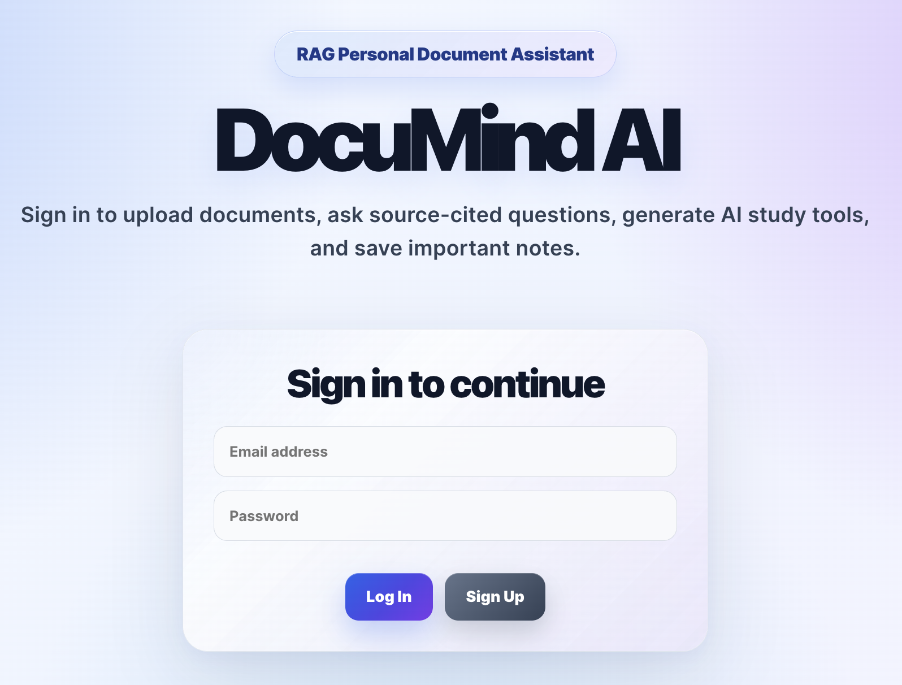
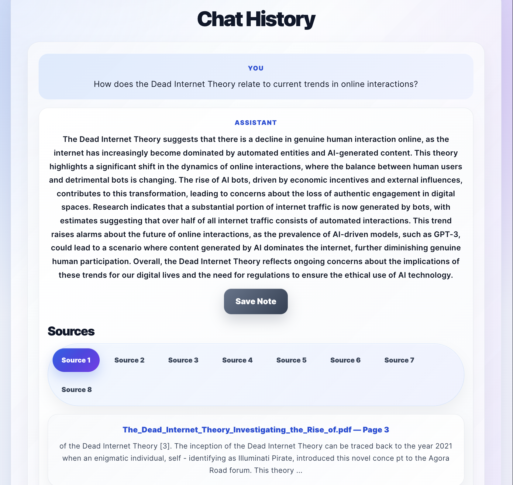
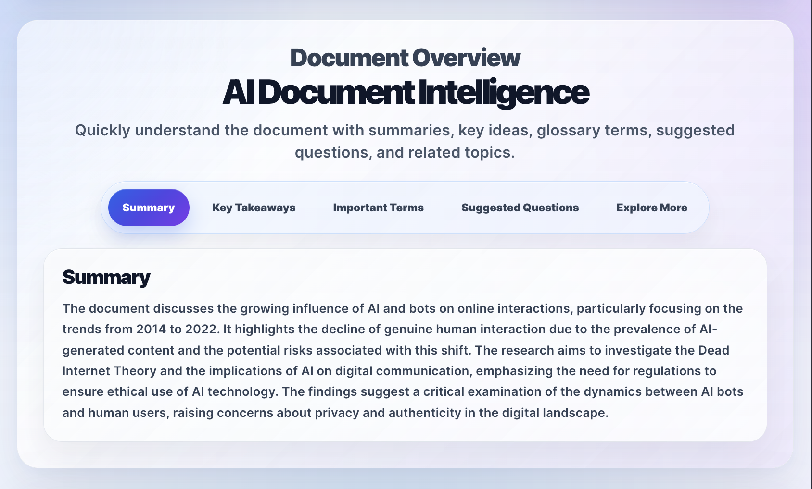
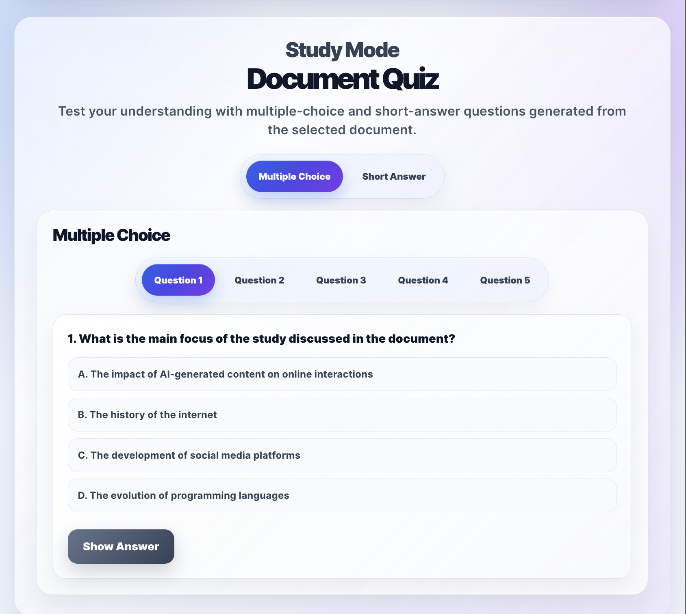
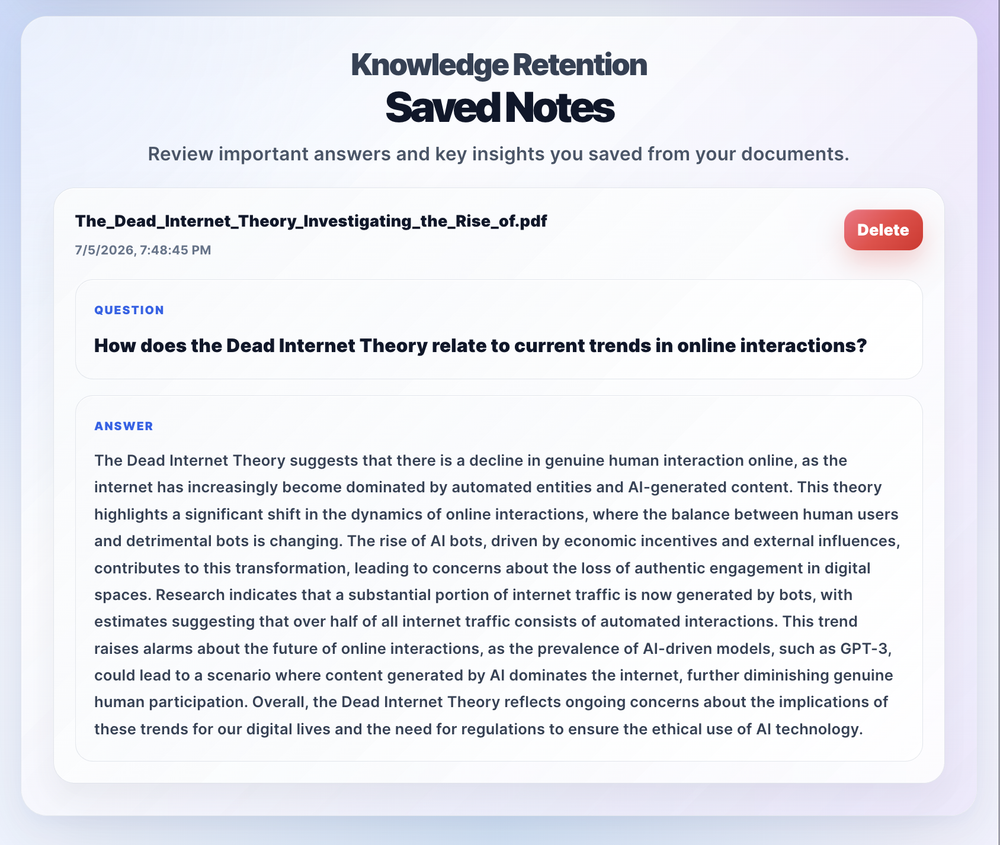

# DocuMind AI — Production-Style RAG Personal Document Assistant

DocuMind AI is a full-stack Retrieval-Augmented Generation application that allows users to securely upload personal documents and interact with them using AI. Users can create an account, upload PDF, DOCX, and TXT files, ask natural language questions, receive source-cited answers, generate document summaries, create study quizzes, and save important AI responses as notes.

The system extracts document text, removes repeated junk content such as ads, headers, footers, and boilerplate text, splits content into searchable chunks, generates OpenAI embeddings, stores persistent vectors in Supabase PostgreSQL with pgvector, and retrieves relevant document sections through semantic search.

DocuMind AI includes a React/Vite frontend deployed on Vercel, a FastAPI backend deployed on Render, and a production-style Supabase architecture for authentication, database persistence, file storage, Row Level Security, and semantic vector search.

---

## Demo Preview

### Authentication


### Document Question Answering


### AI Document Intelligence


### Study Quiz


### Saved Notes


---

## Live Demo

Frontend:

```text
https://documind-ai-assistant.vercel.app/
```

Backend API:

```text
https://documind-ai-backend-wr40.onrender.com
```

FastAPI Docs:

```text
https://documind-ai-backend-wr40.onrender.com/docs
```
---

## Project Highlights

* Production-style multi-user RAG application
* Supabase Auth for user accounts
* Supabase PostgreSQL for user-owned metadata and saved notes
* Supabase Storage for persistent uploaded files
* Supabase pgvector for persistent semantic retrieval
* Row Level Security for user data isolation
* FastAPI backend with pytest API tests
* GitHub Actions CI for automated backend testing
* Deployed frontend on Vercel and backend on Render

---

## Features

### Authentication and User Accounts

* User sign up and login with Supabase Auth
* Persistent authenticated sessions
* Protected application access
* Log out functionality
* Logged-in user displayed in the UI
* User-specific document libraries
* User-specific saved notes
* User-specific vector search filtering

### Document Upload and Management

* Upload PDF, DOCX, and TXT documents
* Extract text from multiple document formats
* Remove repeated document noise such as ads, headers, footers, and boilerplate text
* Split documents into smaller searchable chunks
* Upload and manage multiple documents
* Select an active document for question answering
* Delete individual documents
* Clear all uploaded documents
* Store uploaded files persistently in Supabase Storage
* Store document metadata in Supabase PostgreSQL
* Prevent users from asking questions before uploading or selecting a document

### Retrieval-Augmented Question Answering

* Generate vector embeddings using OpenAI
* Store embeddings persistently in Supabase PostgreSQL with pgvector
* Search document chunks using semantic similarity
* Filter retrieval by both user ID and document ID
* Prevent source mixing across different users and documents
* Generate AI-powered answers using retrieved document context
* Display source citations with filename, page number, preview text, and clickable links
* Open cited PDF sources directly from Supabase Storage
* Maintain chat history during the current session

### AI Document Intelligence

* Generate a high-level document summary
* Extract key takeaways from uploaded documents
* Identify important terms and definitions
* Suggest helpful follow-up questions
* Recommend related topics for deeper exploration
* Display document insights in a polished tab-based interface

### Study Quiz Generation

* Generate multiple-choice questions from uploaded document content
* Generate short-answer questions from uploaded document content
* Display one question at a time using a clean tabbed layout
* Allow users to reveal answers and explanations
* Help users study and retain information from their uploaded files

### Saved Notes

* Save important AI-generated answers as notes
* Store saved notes in Supabase PostgreSQL
* Tie saved notes to the authenticated user
* Display saved notes with the original question, answer, document name, and timestamp
* Delete saved notes from the database
* Preserve saved notes across refreshes, devices, and sessions

### Testing and CI/CD

* Backend API tests with pytest
* Health check endpoint for backend availability
* Route validation tests for chat and document endpoints
* GitHub Actions workflow for automated backend testing
* CI pipeline runs tests on push and pull requests

### User Interface

* Polished React frontend with responsive design
* Modern glassmorphism-inspired UI
* Clean card-based layout
* Tabbed panels for AI overview, quizzes, source citations, and document actions
* Clickable citation panels for easier source review
* User account controls in the main interface
* Mobile-friendly layout
* Deployed frontend on Vercel
* Deployed backend on Render

---

## Tech Stack

### Frontend

* React
* Vite
* Axios
* Supabase JavaScript Client
* CSS
* Vercel

### Backend

* FastAPI
* Python
* LangChain
* OpenAI API
* Supabase Python Client
* Supabase PostgreSQL
* Supabase Storage
* Supabase pgvector
* PyPDF
* python-docx
* Uvicorn
* Render
* pytest

### Database and Infrastructure

* Supabase Auth
* Supabase PostgreSQL
* Supabase Storage
* pgvector
* Row Level Security
* GitHub Actions
* Render
* Vercel

---

## How It Works

The app follows a production-style Retrieval-Augmented Generation pipeline:

```text
User signs up or logs in
        ↓
User uploads a PDF, DOCX, or TXT document
        ↓
FastAPI receives the uploaded file
        ↓
File is saved to Supabase Storage
        ↓
Document metadata is saved to Supabase PostgreSQL
        ↓
Text is extracted from the document
        ↓
Repeated junk text is removed
        ↓
Text is split into searchable chunks
        ↓
OpenAI creates vector embeddings
        ↓
Embeddings are stored in Supabase PostgreSQL with pgvector
        ↓
User selects a document and asks a question
        ↓
Backend searches pgvector using user ID and document ID filters
        ↓
Relevant chunks are retrieved through semantic similarity
        ↓
OpenAI generates an answer using retrieved context
        ↓
Answer is returned with clickable source citations
        ↓
Users can save important answers as database-backed notes
```

---

## AI Document Intelligence Flow

```text
User selects an uploaded document
        ↓
User clicks Generate Document Overview
        ↓
Backend retrieves representative document content
        ↓
OpenAI analyzes the document
        ↓
The app returns:
    - Summary
    - Key takeaways
    - Important terms
    - Suggested questions
    - Related topics
        ↓
Frontend displays results in a tabbed interface
```

---

## Quiz Generation Flow

```text
User selects an uploaded document
        ↓
User clicks Generate Study Quiz
        ↓
Backend retrieves relevant document content
        ↓
OpenAI generates quiz content
        ↓
The app returns:
    - Multiple-choice questions
    - Short-answer questions
    - Answers
    - Explanations
        ↓
Frontend displays questions one at a time
```

---

## Architecture

```text
React/Vite Frontend
    │
    ├── Supabase Auth login/signup
    ├── Upload PDF, DOCX, or TXT files
    ├── Display user-owned documents
    ├── Select active document
    ├── Ask document-specific questions
    ├── Show chat history
    ├── Save important answers as notes
    ├── Generate document intelligence
    ├── Generate study quizzes
    └── Display clickable source citations
            ↓
FastAPI Backend
    │
    ├── Health check endpoint
    ├── Document upload endpoint
    ├── Document list endpoint
    ├── Individual document delete endpoint
    ├── Clear all documents endpoint
    ├── Question-answering endpoint
    ├── Document intelligence endpoint
    └── Quiz generation endpoint
            ↓
Document Processing
    │
    ├── PDF text extraction
    ├── DOCX text extraction
    ├── TXT text extraction
    ├── Repeated header/ad/footer filtering
    ├── Text chunking
    └── Metadata assignment
            ↓
Supabase
    │
    ├── Auth for user accounts
    ├── PostgreSQL for saved notes and document metadata
    ├── Storage for uploaded files
    ├── pgvector for persistent embeddings
    └── Row Level Security for user-owned data
            ↓
Vector Search
    │
    ├── OpenAI embeddings
    ├── pgvector semantic similarity search
    ├── User ID filtering
    ├── Document ID filtering
    └── Source-cited retrieval
            ↓
LLM Response
    │
    ├── Retrieved context
    ├── OpenAI chat model
    ├── Source-cited answers
    ├── Document summaries
    └── Study quiz generation
            ↓
Testing and CI/CD
    │
    ├── pytest backend tests
    ├── API validation tests
    ├── Health check tests
    └── GitHub Actions CI workflow
```

---

## Production-Ready Features

DocuMind AI includes several production-style engineering features:

```text
Authentication
User-owned data
Persistent database storage
Persistent file storage
Persistent vector search
Row Level Security
Backend validation
API testing
GitHub Actions CI
Cloud deployment
Environment-based configuration
```

These features move the project beyond a simple local RAG demo and closer to a real multi-user SaaS application.

---

## Supabase Database Tables

### `documents`

Stores user-owned document metadata.

```text
id
user_id
document_id
filename
pages_loaded
chunks_created
storage_path
storage_url
created_at
```

### `saved_notes`

Stores user-owned saved AI responses.

```text
id
user_id
document_id
document_name
question
answer
created_at
```

### `document_chunks`

Stores persistent document chunks and embeddings for semantic search.

```text
id
user_id
document_id
filename
stored_filename
storage_path
storage_url
page
chunk_index
content
embedding
created_at
```

---

## Row Level Security

Supabase Row Level Security is enabled for user-owned tables.

Users can only access records where:

```text
auth.uid() = user_id
```

This applies to:

```text
documents
saved_notes
document_chunks
```

This ensures each user can only view, insert, and delete their own data.

---

## Project Structure

```text
RagDocumentAssistantProject/
│
├── backend/
│   ├── app/
│   │   ├── main.py
│   │   ├── config.py
│   │   ├── routes/
│   │   │   ├── upload_routes.py
│   │   │   ├── chat_routes.py
│   │   │   ├── intelligence_routes.py
│   │   │   └── quiz_routes.py
│   │   └── services/
│   │       ├── pdf_service.py
│   │       ├── vector_service.py
│   │       ├── rag_service.py
│   │       ├── pgvector_service.py
│   │       ├── storage_service.py
│   │       ├── intelligence_service.py
│   │       ├── quiz_service.py
│   │       └── document_registry.py
│   │
│   ├── tests/
│   │   ├── conftest.py
│   │   ├── test_health.py
│   │   ├── test_chat_routes.py
│   │   └── test_document_routes.py
│   │
│   ├── requirements.txt
│   └── .env
│
├── frontend/
│   ├── public/
│   ├── src/
│   │   ├── App.jsx
│   │   ├── api.js
│   │   ├── supabaseClient.js
│   │   ├── notesService.js
│   │   ├── documentService.js
│   │   └── styles.css
│   │
│   ├── package.json
│   └── vite.config.js
│
├── .github/
│   └── workflows/
│       └── backend-tests.yml
│
├── .gitignore
└── README.md
```

> Note: `.env`, `venv/`, `node_modules/`, local uploads, local ChromaDB files, cache files, and generated local registry files are intentionally excluded from GitHub.

---

## Backend Setup

Navigate to the backend folder:

```bash
cd backend
```

Create a virtual environment:

```bash
python -m venv venv
```

Activate the virtual environment:

```bash
source venv/bin/activate
```

Install dependencies:

```bash
pip install -r requirements.txt
```

Create a `.env` file inside the `backend` folder:

```env
OPENAI_API_KEY=your_openai_api_key_here
SUPABASE_URL=your_supabase_project_url
SUPABASE_SERVICE_ROLE_KEY=your_supabase_service_role_key
SUPABASE_STORAGE_BUCKET=documents
CHROMA_DB_PATH=./chroma_db
UPLOAD_DIR=./uploads
```

Run the backend server:

```bash
python -m uvicorn app.main:app --reload
```

The backend will run at:

```text
http://127.0.0.1:8000
```

FastAPI documentation is available at:

```text
http://127.0.0.1:8000/docs
```

Health check endpoint:

```text
http://127.0.0.1:8000/health
```

---

## Frontend Setup

Navigate to the frontend folder:

```bash
cd frontend
```

Install dependencies:

```bash
npm install
```

Create a `.env` file inside the `frontend` folder:

```env
VITE_API_BASE_URL=http://127.0.0.1:8000
VITE_SUPABASE_URL=your_supabase_project_url
VITE_SUPABASE_ANON_KEY=your_supabase_anon_public_key
```

Run the frontend development server:

```bash
npm run dev
```

The frontend will run at:

```text
http://localhost:5173
```

---

## Supabase Setup

### Required Supabase Services

```text
Supabase Auth
Supabase PostgreSQL
Supabase Storage
pgvector extension
Row Level Security
```

### Storage Bucket

Create a Supabase Storage bucket named:

```text
documents
```

### pgvector Extension

Enable pgvector:

```sql
create extension if not exists vector with schema extensions;
```

### Semantic Search Function

The backend uses a Supabase RPC function to match document chunks by vector similarity:

```text
match_document_chunks
```

This function retrieves relevant chunks by:

```text
query_embedding
match_user_id
match_document_id
match_count
```

---

## Deployment

### Frontend

The frontend is deployed on Vercel.

Required Vercel environment variables:

```env
VITE_API_BASE_URL=https://your-render-backend-url.onrender.com
VITE_SUPABASE_URL=your_supabase_project_url
VITE_SUPABASE_ANON_KEY=your_supabase_anon_public_key
```

### Backend

The backend is deployed on Render.

Render settings:

```text
Root Directory: backend
Build Command: pip install -r requirements.txt
Start Command: python -m uvicorn app.main:app --host 0.0.0.0 --port $PORT
```

Required Render environment variables:

```env
OPENAI_API_KEY=your_openai_api_key_here
SUPABASE_URL=your_supabase_project_url
SUPABASE_SERVICE_ROLE_KEY=your_supabase_service_role_key
SUPABASE_STORAGE_BUCKET=documents
CHROMA_DB_PATH=./chroma_db
UPLOAD_DIR=./uploads
```

---

## API Endpoints

### Health Check

```http
GET /health
```

Returns backend status.

Example response:

```json
{
  "status": "ok"
}
```

### Upload Document

```http
POST /documents/upload
```

Uploads a PDF, DOCX, or TXT document, stores the file in Supabase Storage, extracts text, removes repeated junk content, creates chunks, generates embeddings, and stores them in Supabase pgvector.

Example response:

```json
{
  "message": "Document uploaded, indexed, and stored successfully",
  "document_id": "example-document-id",
  "filename": "example.pdf",
  "stored_filename": "example-document-id_example.pdf",
  "pages_loaded": 3,
  "chunks_created": 8,
  "pgvector_chunks_created": 8,
  "storage_path": "user-id/example-document-id_example.pdf",
  "storage_url": "https://your-project.supabase.co/storage/v1/object/public/documents/user-id/example-document-id_example.pdf"
}
```

### List Uploaded Documents

```http
GET /documents/
```

Returns uploaded documents from the backend registry.

Example response:

```json
{
  "documents": [
    {
      "document_id": "example-document-id",
      "filename": "example.pdf",
      "pages_loaded": 3,
      "chunks_created": 8,
      "pgvector_chunks_created": 8,
      "storage_path": "user-id/example-document-id_example.pdf",
      "storage_url": "https://your-project.supabase.co/storage/v1/object/public/documents/user-id/example-document-id_example.pdf"
    }
  ]
}
```

### Ask a Question

```http
POST /chat/ask
```

Accepts a user question, document ID, and user ID. Retrieves relevant chunks from Supabase pgvector and returns an AI-generated answer with source citations.

Example request:

```json
{
  "question": "What is this document about?",
  "document_id": "example-document-id",
  "user_id": "example-user-id"
}
```

Example response:

```json
{
  "answer": "The document explains...",
  "sources": [
    {
      "source": "example.pdf",
      "page": 1,
      "preview": "This section discusses...",
      "url": "https://your-project.supabase.co/storage/v1/object/public/documents/user-id/example-document-id_example.pdf#page=1",
      "similarity": 0.82
    }
  ]
}
```

### Generate Document Intelligence

```http
POST /documents/{document_id}/intelligence
```

Generates a structured overview of the selected document, including summary, key takeaways, important terms, suggested questions, and related topics.

Example response:

```json
{
  "document_id": "example-document-id",
  "filename": "example.pdf",
  "intelligence": {
    "summary": "This document explains...",
    "key_takeaways": [
      "Key idea one",
      "Key idea two"
    ],
    "important_terms": [
      {
        "term": "Example Term",
        "definition": "A short definition of the term."
      }
    ],
    "suggested_questions": [
      "What is the main argument of this document?"
    ],
    "related_topics": [
      "Related topic one",
      "Related topic two"
    ]
  }
}
```

### Generate Study Quiz

```http
POST /documents/{document_id}/quiz
```

Generates multiple-choice and short-answer questions from the selected document.

Example response:

```json
{
  "document_id": "example-document-id",
  "filename": "example.pdf",
  "quiz": {
    "multiple_choice": [
      {
        "question": "What is the main idea of the document?",
        "options": [
          "A. Option one",
          "B. Option two",
          "C. Option three",
          "D. Option four"
        ],
        "answer": "A. Option one",
        "explanation": "This answer is supported by the document because..."
      }
    ],
    "short_answer": [
      {
        "question": "Explain the main idea in your own words.",
        "answer": "The document mainly explains...",
        "explanation": "This is supported by the document because..."
      }
    ]
  }
}
```

### Delete a Document

```http
DELETE /documents/{document_id}
```

Deletes a specific document, removes its vector chunks, removes the file from Supabase Storage, and removes its metadata from the user’s document list.

Example response:

```json
{
  "message": "Document deleted successfully",
  "document_id": "example-document-id"
}
```

### Clear All Documents

```http
DELETE /documents/clear/all
```

Clears uploaded documents, removes associated vector chunks, and clears document metadata.

Example response:

```json
{
  "message": "All documents cleared successfully"
}
```

---

## Testing

The backend includes pytest tests for core API behavior.

Run tests from the backend folder:

```bash
cd backend
source venv/bin/activate
python -m pytest
```

Current test coverage includes:

```text
Health check endpoint
Chat request validation
Document listing endpoint
Unsupported upload validation
```

---

## GitHub Actions CI

This project includes a GitHub Actions workflow that automatically runs backend tests on push and pull requests.

Workflow file:

```text
.github/workflows/backend-tests.yml
```

The workflow:

```text
Checks out the repository
Sets up Python
Installs backend dependencies
Runs pytest
```

Required GitHub repository secrets:

```text
OPENAI_API_KEY
SUPABASE_URL
SUPABASE_SERVICE_ROLE_KEY
```

---

## Current Behavior

DocuMind AI supports authenticated users with their own document libraries, saved notes, uploaded files, and vector-searchable document chunks. Each uploaded document receives a unique document ID, and each embedded chunk is stored with metadata tied to the authenticated user and selected document.

When a user asks a question, the backend searches Supabase pgvector using both the user ID and document ID. This keeps answers grounded in the selected document and prevents data from mixing across users.

The frontend displays uploaded documents, the current selected document, chat history, AI document intelligence, generated quizzes, saved notes, and clickable source citations. PDF citations open the Supabase-hosted file directly to the cited page when supported by the browser.

Saved notes are stored in Supabase PostgreSQL and remain available after refresh, logout, and login.

---

## Known Limitations

* The app uses public Supabase Storage URLs for easier portfolio demo access.
* Browser PDF viewers can jump to a cited page, but they cannot reliably highlight the exact cited sentence inside the PDF.
* DOCX files may download instead of previewing directly in the browser, depending on browser behavior.
* Chat history is currently session-based and not stored permanently.
* AI-generated quizzes and document intelligence are generated on demand and not yet cached.
* This project is designed as a portfolio/demo application and is not yet configured for enterprise compliance requirements.

---

## Environment Variables

### Backend

```env
OPENAI_API_KEY=your_openai_api_key_here
SUPABASE_URL=your_supabase_project_url
SUPABASE_SERVICE_ROLE_KEY=your_supabase_service_role_key
SUPABASE_STORAGE_BUCKET=documents
CHROMA_DB_PATH=./chroma_db
UPLOAD_DIR=./uploads
```

### Frontend

```env
VITE_API_BASE_URL=http://127.0.0.1:8000
VITE_SUPABASE_URL=your_supabase_project_url
VITE_SUPABASE_ANON_KEY=your_supabase_anon_public_key
```

For deployment, use your Render backend URL:

```env
VITE_API_BASE_URL=https://your-render-backend-url.onrender.com
```

---

## Security Notes

The following files and folders should not be pushed to GitHub:

```text
backend/.env
frontend/.env
.env
backend/venv/
venv/
frontend/node_modules/
backend/uploads/
backend/chroma_db/
backend/documents.json
backend/.pytest_cache/
backend/__pycache__/
```

The frontend uses the Supabase anon public key. The Supabase service role key is only used on the backend and should never be exposed in browser code.

Supabase Row Level Security is enabled so authenticated users can only access their own database records.

---

## Problems Solved

DocuMind AI solves the problem of manually searching through long documents by allowing users to ask natural language questions and receive document-grounded answers. Instead of relying on keyword search or general chatbot knowledge, the app uses semantic retrieval to find relevant document sections and generate answers from uploaded content.

The project improves transparency by returning clickable source citations, helping users verify where answers came from.

It also supports learning and retention. Users can generate document summaries, key takeaways, glossary terms, suggested questions, related topics, and study quizzes. This turns uploaded documents into interactive study material rather than static files.

DocuMind AI also addresses several production challenges common in AI applications:

```text
User authentication
User-specific data isolation
Persistent file storage
Persistent vector storage
Database-backed notes
Row Level Security
Cloud deployment
Automated backend testing
CI/CD validation
```

In addition, the project addresses a common real-world RAG challenge: noisy document extraction. Web-exported PDFs often contain repeated ads, headers, footers, and navigation text. DocuMind AI includes preprocessing logic to reduce repeated junk content before generating embeddings, improving retrieval quality and citation relevance.

---

## Future Improvements

* Store chat history in Supabase PostgreSQL
* Cache generated quizzes and document intelligence results
* Add private Supabase Storage with signed URLs
* Add file size limits and upload progress indicators
* Add streaming AI responses
* Add downloadable chat history
* Add downloadable saved notes
* Add custom PDF viewer with exact text highlighting
* Add user dashboard analytics
* Add frontend tests
* Add more advanced backend tests with mocked OpenAI and Supabase services
* Add rate limiting
* Add admin monitoring/logging

---

## Resume Summary

Built and deployed a production-style multi-user Retrieval-Augmented Generation document assistant using React, FastAPI, OpenAI, LangChain, Supabase Auth, PostgreSQL, Storage, pgvector, and Row Level Security. The application supports authenticated user accounts, user-owned document libraries, persistent file storage, persistent semantic vector search, source-cited AI answers, AI-generated document summaries, study quizzes, database-backed saved notes, backend API tests, and GitHub Actions CI.

---

## Author

Aaron Cole