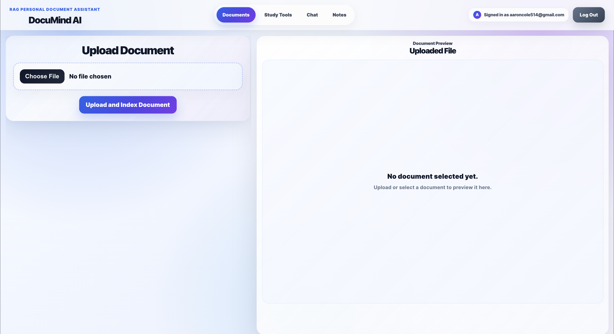
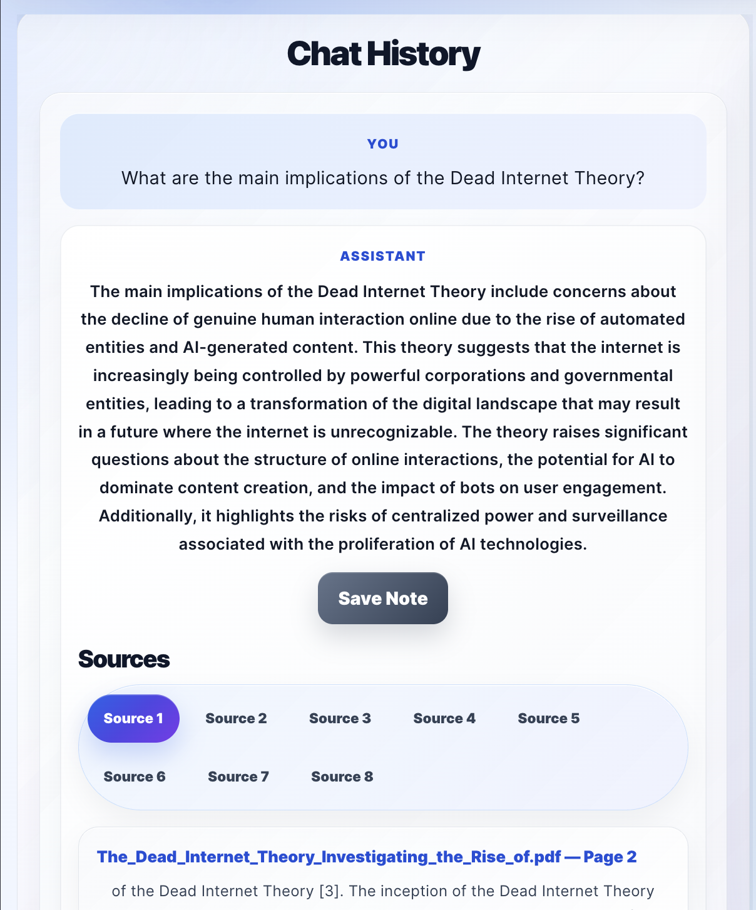
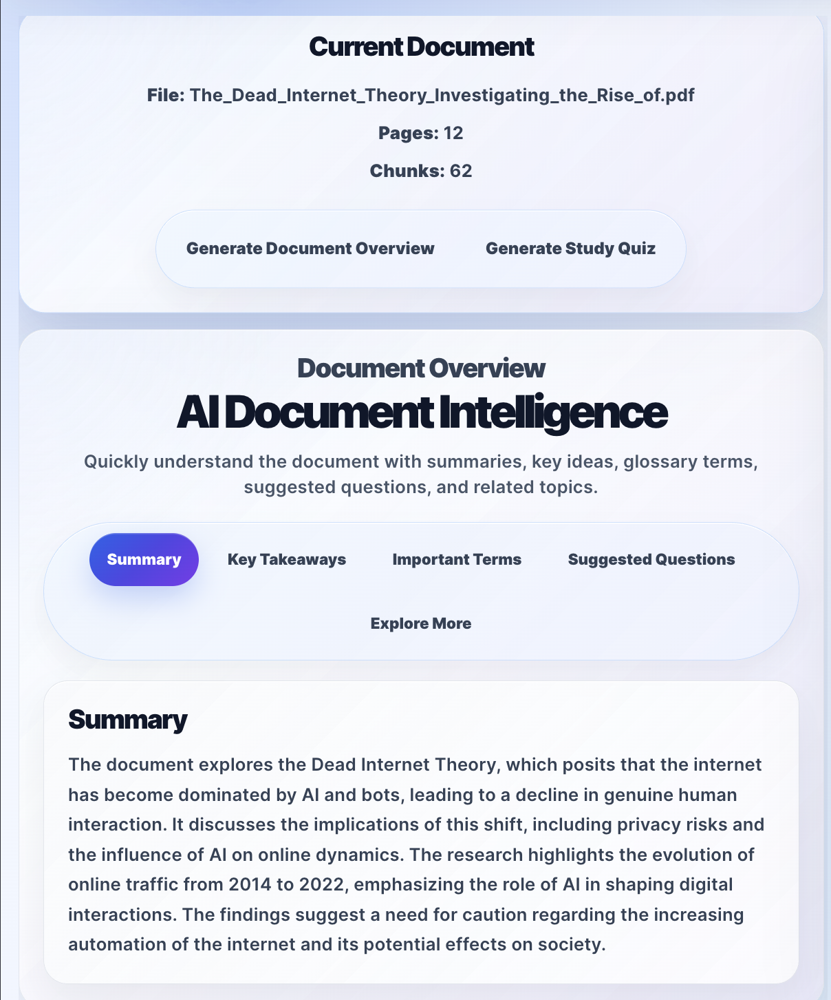
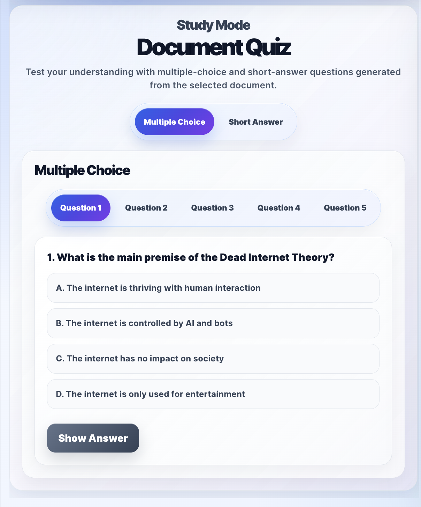
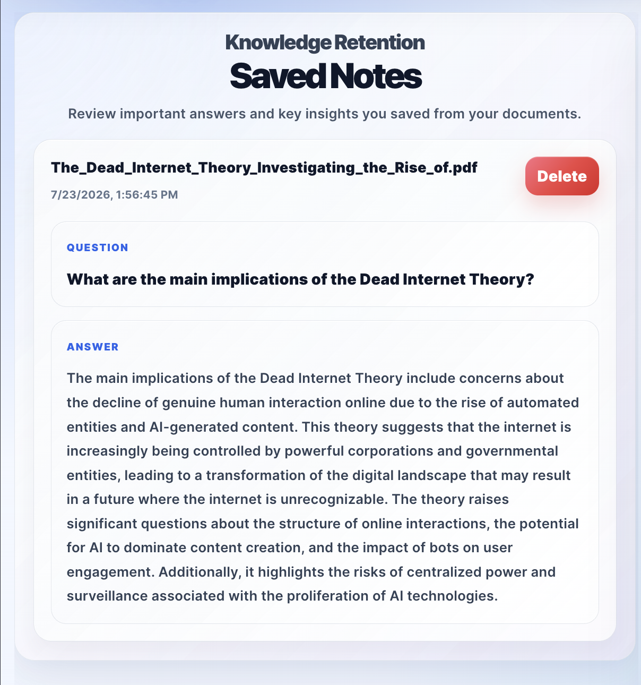

# DocuMind AI — Secure RAG Document Intelligence Platform

DocuMind AI is a full-stack AI document intelligence platform that allows authenticated users to upload documents, ask source-cited questions, generate study tools, save important notes, and preview cited PDF pages directly in the browser.

The application uses a production-style architecture with a React/Vite frontend, FastAPI backend, Supabase Auth, Supabase Storage, PostgreSQL with pgvector, OpenAI embeddings, and OpenAI chat models. Backend routes verify Supabase access tokens and use the verified user ID to scope uploads, retrieval, chat responses, document intelligence, quiz generation, saved notes, and delete/clear workflows.

---
## Demo Screenshots

### Workspace



### Source-Cited Chat



### Document Intelligence



### Study Quiz



### Saved Notes



## Live Demo

### Frontend

```text
https://documind-ai-assistant.vercel.app/
```

### Backend API

```text
https://documind-ai-backend-wr40.onrender.com
```

### FastAPI Docs

```text
https://documind-ai-backend-wr40.onrender.com/docs
```

---

## Overview

DocuMind AI helps users turn static documents into interactive, searchable, study-ready knowledge.

Users can upload PDF, DOCX, or TXT files and ask questions grounded only in the selected document. The system extracts document text, removes repeated junk content such as headers, footers, advertisements, and boilerplate text, splits the document into searchable chunks, creates OpenAI embeddings, stores them in Supabase PostgreSQL with pgvector, and retrieves relevant chunks when the user asks a question.

The app returns AI-generated answers with source citations, page numbers, preview snippets, and clickable citation navigation inside a custom PDF preview panel. Users can also generate document summaries, key takeaways, glossary terms, suggested questions, related topics, study quizzes, persistent chat history, and saved notes.

---

## Key Features

### Authentication and User-Owned Data

- Secure user sign-up and login with Supabase Auth
- User-specific document libraries
- User-scoped document chunks using PostgreSQL pgvector
- Backend verification of Supabase access tokens
- Protected upload, chat, overview, quiz, delete, and clear routes
- Backend does not trust frontend-provided user IDs
- Persistent user data through Supabase tables

### Document Upload and Management

- Upload PDF, DOCX, and TXT documents
- Store original files in Supabase Storage
- Store document metadata in Supabase PostgreSQL
- Track filename, document ID, page count, chunk count, storage path, and storage URL
- Select documents from a user-owned document library
- Delete individual documents
- Clear all documents for the logged-in user
- Clean up Supabase Storage files, pgvector chunks, and metadata on delete

### Retrieval-Augmented Question Answering

- Generate OpenAI embeddings for document chunks
- Store embeddings in Supabase PostgreSQL with pgvector
- Retrieve chunks by verified `user_id` and selected `document_id`
- Prevent one user’s documents from mixing with another user’s retrieval results
- Generate grounded AI answers from retrieved document context
- Return source citations with page numbers and preview text
- Display chat history per user and selected document

### PDF Preview and Source Navigation

- Custom PDF preview panel using React PDF
- Preview uploaded PDF files directly in the app
- Click source citations to scroll to the cited PDF page
- Highlight the active cited page
- Track current preview page while scrolling
- Zoom PDF preview in and out

### AI Document Intelligence

- Generate structured document summaries
- Extract key takeaways
- Identify important terms and definitions
- Suggest useful follow-up questions
- Recommend related topics for deeper learning
- Display results in a clean study workspace

### Study Quiz Generation

- Generate multiple-choice questions from uploaded documents
- Generate short-answer questions from uploaded documents
- Show one question at a time
- Reveal answers and explanations
- Help users study and retain document content

### Saved Notes

- Save important AI answers as notes
- Store saved notes in Supabase
- Tie notes to the logged-in user and selected document
- Display saved notes with question, answer, document name, and timestamp
- Delete saved notes when no longer needed

### UI and Workspace

- Modern React/Vite frontend
- Top navigation workspace tabs
- Sections for Documents, Study Tools, Chat, and Notes
- Responsive card-based interface
- Temporary tab notification badges for new/saved/generated content
- Deployed frontend on Vercel
- Deployed backend on Render

### Testing and CI

- Backend tests with Pytest
- FastAPI route tests using TestClient
- Auth dependency overrides for protected route tests
- GitHub Actions workflow for backend test automation
- Production deploys tested on Render and Vercel

---

## Tech Stack

### Frontend

- React
- Vite
- JavaScript
- Axios
- Supabase JS Client
- React PDF
- CSS
- Vercel

### Backend

- FastAPI
- Python
- Uvicorn
- OpenAI API
- LangChain
- PyPDF
- python-docx
- Supabase Python Client
- PostgreSQL
- pgvector
- Pytest
- Render

### Cloud and Infrastructure

- Supabase Auth
- Supabase Storage
- Supabase PostgreSQL
- Supabase pgvector
- Render backend deployment
- Vercel frontend deployment
- GitHub Actions CI

---

## Architecture

```text
React/Vite Frontend
        ↓
Supabase Auth Session
        ↓
Bearer Token Sent to FastAPI
        ↓
FastAPI Backend Verifies Token
        ↓
Verified Supabase User ID
        ↓
User-Scoped Document Workflows
        ↓
Supabase Storage + PostgreSQL + pgvector
        ↓
OpenAI Embeddings + Chat Responses
        ↓
Source-Cited Answers, Study Tools, Notes, and PDF Preview
```

---

## How It Works

```text
User signs in with Supabase Auth
        ↓
User uploads PDF, DOCX, or TXT document
        ↓
Frontend sends Supabase access token to FastAPI
        ↓
Backend verifies token and extracts verified user ID
        ↓
Backend saves uploaded file temporarily
        ↓
Original file is uploaded to Supabase Storage
        ↓
Document text is extracted
        ↓
Repeated junk text is filtered
        ↓
Text is split into chunks
        ↓
Chunks are sanitized for PostgreSQL compatibility
        ↓
OpenAI creates embeddings for each chunk
        ↓
Chunks and embeddings are stored in Supabase pgvector
        ↓
Frontend saves document metadata to Supabase documents table
        ↓
User selects a document and asks a question
        ↓
Backend retrieves matching chunks by user_id + document_id
        ↓
OpenAI generates an answer from retrieved context
        ↓
Answer, sources, and chat history are displayed in the app
```

---

## Security and User Data Isolation

DocuMind AI uses Supabase access tokens to secure backend routes.

The frontend sends the logged-in user’s Supabase session token with protected API requests. The FastAPI backend verifies that token before processing uploads, questions, document intelligence, quiz generation, delete requests, and clear requests.

The backend does not trust user IDs sent from the frontend. Instead, it extracts the verified user ID from Supabase Auth and uses that ID to scope:

- Document uploads
- Supabase Storage paths
- pgvector chunk storage
- Semantic retrieval
- Chat responses
- Document intelligence
- Quiz generation
- Delete document workflow
- Clear all documents workflow

This prevents users from accessing, retrieving, or deleting another user’s document data.

---

## Database Tables

### documents

Stores user-owned document metadata.

```text
id
user_id
document_id
filename
pages_loaded
chunks_created
storage_path
storage_url
created_at
```

### document_chunks

Stores document chunks and vector embeddings.

```text
id
user_id
document_id
filename
stored_filename
storage_path
storage_url
page
chunk_index
content
embedding
created_at
```

### chat_history

Stores persistent chat history per user and document.

```text
id
user_id
document_id
document_name
question
answer
sources
created_at
```

### saved_notes

Stores saved AI answers as notes.

```text
id
user_id
document_id
document_name
question
answer
created_at
```

---

## API Endpoints

Protected routes require a Supabase Bearer token:

```http
Authorization: Bearer <supabase_access_token>
```

### Health Check

```http
GET /health
```

Returns backend health status.

### Upload Document

```http
POST /documents/upload
```

Uploads, processes, embeds, and stores a document.

Supported file types:

```text
.pdf
.docx
.txt
```

Example response:

```json
{
  "message": "Document uploaded, indexed, and stored successfully",
  "document_id": "example-document-id",
  "filename": "example.pdf",
  "stored_filename": "example-document-id_example.pdf",
  "pages_loaded": 5,
  "chunks_created": 24,
  "pgvector_chunks_created": 24,
  "storage_path": "user-id/example-document-id_example.pdf",
  "storage_url": "https://example.supabase.co/storage/v1/object/public/documents/user-id/example-document-id_example.pdf"
}
```

### Ask a Question

```http
POST /chat/ask
```

Example request:

```json
{
  "question": "What is this document about?",
  "document_id": "example-document-id"
}
```

Example response:

```json
{
  "answer": "The document explains...",
  "sources": [
    {
      "source": "example.pdf",
      "page": 1,
      "preview": "This section discusses...",
      "url": "https://example.supabase.co/storage/v1/object/public/documents/user-id/example.pdf"
    }
  ]
}
```

### Generate Document Intelligence

```http
POST /documents/{document_id}/intelligence
```

Generates a structured overview of the selected document.

Example response:

```json
{
  "document_id": "example-document-id",
  "intelligence": {
    "summary": "This document explains...",
    "key_takeaways": [
      "Key idea one",
      "Key idea two"
    ],
    "important_terms": [
      {
        "term": "Example Term",
        "definition": "A short definition based on the document."
      }
    ],
    "suggested_questions": [
      "What is the main argument of this document?"
    ],
    "related_topics": [
      "Related topic one",
      "Related topic two"
    ]
  }
}
```

### Generate Study Quiz

```http
POST /documents/{document_id}/quiz
```

Generates multiple-choice and short-answer questions from the selected document.

Example response:

```json
{
  "document_id": "example-document-id",
  "quiz": {
    "multiple_choice": [
      {
        "question": "What is the main idea of the document?",
        "options": [
          "A. Option one",
          "B. Option two",
          "C. Option three",
          "D. Option four"
        ],
        "answer": "A. Option one",
        "explanation": "This answer is supported by the document because..."
      }
    ],
    "short_answer": [
      {
        "question": "Explain the main idea in your own words.",
        "answer": "The document mainly explains...",
        "explanation": "This is supported by the document because..."
      }
    ]
  }
}
```

### Delete a Document

```http
DELETE /documents/{document_id}
```

Deletes a specific document for the verified user.

This removes:

- Original file from Supabase Storage
- Document chunks from pgvector
- Document metadata from Supabase PostgreSQL

Example response:

```json
{
  "message": "Document deleted successfully",
  "document_id": "example-document-id"
}
```

### Clear All Documents

```http
DELETE /documents/clear/all
```

Clears all documents for the verified user.

This removes:

- All user files from Supabase Storage
- All user document chunks from pgvector
- All user document metadata from Supabase PostgreSQL

Example response:

```json
{
  "message": "Your documents were cleared successfully"
}
```

---

## Project Structure

```text
RagDocumentAssistantProject/
│
├── backend/
│   ├── app/
│   │   ├── main.py
│   │   ├── config.py
│   │   ├── routes/
│   │   │   ├── chat_routes.py
│   │   │   ├── health_routes.py
│   │   │   ├── intelligence_routes.py
│   │   │   ├── quiz_routes.py
│   │   │   └── upload_routes.py
│   │   └── services/
│   │       ├── auth_service.py
│   │       ├── chat_history_service.py
│   │       ├── intelligence_service.py
│   │       ├── notes_service.py
│   │       ├── pdf_service.py
│   │       ├── pgvector_service.py
│   │       ├── quiz_service.py
│   │       ├── rag_service.py
│   │       ├── storage_service.py
│   │       └── vector_service.py
│   │
│   ├── tests/
│   │   ├── conftest.py
│   │   ├── test_chat_routes.py
│   │   ├── test_document_routes.py
│   │   └── test_health.py
│   │
│   ├── requirements.txt
│   └── .env
│
├── frontend/
│   ├── public/
│   ├── src/
│   │   ├── App.jsx
│   │   ├── api.js
│   │   ├── chatHistoryService.js
│   │   ├── documentService.js
│   │   ├── notesService.js
│   │   ├── styles.css
│   │   └── supabaseClient.js
│   │
│   ├── package.json
│   └── vite.config.js
│
├── screenshots/
├── .github/
│   └── workflows/
│       └── backend-tests.yml
│
├── .gitignore
└── README.md
```

> Note: `.env`, `venv/`, `node_modules/`, local uploads, local ChromaDB files, and other generated local artifacts should not be pushed to GitHub.

---

## Local Development Setup

### 1. Clone the Repository

```bash
git clone https://github.com/YOUR_USERNAME/rag-document-assistant.git
cd rag-document-assistant
```

---

## Backend Setup

Navigate to the backend folder:

```bash
cd backend
```

Create a virtual environment:

```bash
python -m venv venv
```

Activate the virtual environment:

```bash
source venv/bin/activate
```

Install dependencies:

```bash
pip install -r requirements.txt
```

Create a `.env` file inside the `backend` folder:

```env
OPENAI_API_KEY=your_openai_api_key_here
SUPABASE_URL=your_supabase_project_url
SUPABASE_SERVICE_ROLE_KEY=your_supabase_service_role_key
SUPABASE_STORAGE_BUCKET=documents
UPLOAD_DIR=./uploads
CHROMA_DB_PATH=./chroma_db
```

Run the backend:

```bash
python -m uvicorn app.main:app --reload
```

Backend will run locally at:

```text
http://127.0.0.1:8000
```

FastAPI docs will be available at:

```text
http://127.0.0.1:8000/docs
```

---

## Frontend Setup

Open a new terminal and navigate to the frontend folder:

```bash
cd frontend
```

Install dependencies:

```bash
npm install
```

Create a `.env.local` file inside the `frontend` folder:

```env
VITE_API_BASE_URL=http://127.0.0.1:8000
VITE_SUPABASE_URL=your_supabase_project_url
VITE_SUPABASE_ANON_KEY=your_supabase_anon_public_key
```

Run the frontend:

```bash
npm run dev
```

Frontend will run locally at:

```text
http://localhost:5173
```

---

## Supabase Setup

This project uses Supabase for authentication, storage, metadata, chat history, saved notes, and vector search.

### Required Supabase Services

- Supabase Auth
- Supabase Storage
- Supabase PostgreSQL
- pgvector extension
- Row Level Security policies

### Required Storage Bucket

```text
documents
```

For a portfolio demo, the bucket may be public so uploaded files can be previewed in the browser. For a stricter production version, private storage with signed URLs would be recommended.

### Required Tables

```text
documents
document_chunks
chat_history
saved_notes
```

### Required pgvector Function

The backend expects a Supabase RPC function that can match document chunks by embedding similarity while filtering by user and document.

Example concept:

```sql
match_document_chunks(
  query_embedding vector(1536),
  match_count int,
  filter_user_id uuid,
  filter_document_id text
)
```

---

## Running Tests

From the backend folder:

```bash
cd backend
source venv/bin/activate
python -m pytest
```

Expected result:

```text
6 passed
```

---

## GitHub Actions

The project includes a GitHub Actions workflow for backend tests.

The workflow runs:

```bash
python -m pytest
```

This helps verify protected backend routes, document route behavior, and health checks before deployment.

---

## Deployment

### Backend Deployment — Render

Recommended Render settings:

```text
Root Directory:
backend

Build Command:
pip install -r requirements.txt

Start Command:
python -m uvicorn app.main:app --host 0.0.0.0 --port $PORT
```

Required Render environment variables:

```env
OPENAI_API_KEY=your_openai_api_key_here
SUPABASE_URL=your_supabase_project_url
SUPABASE_SERVICE_ROLE_KEY=your_supabase_service_role_key
SUPABASE_STORAGE_BUCKET=documents
UPLOAD_DIR=./uploads
CHROMA_DB_PATH=./chroma_db
```

Important: The Supabase service role key should only be stored in the backend environment.

### Frontend Deployment — Vercel

Required Vercel environment variables:

```env
VITE_API_BASE_URL=https://documind-ai-backend-wr40.onrender.com
VITE_SUPABASE_URL=your_supabase_project_url
VITE_SUPABASE_ANON_KEY=your_supabase_anon_public_key
```

Important: Do not store the Supabase service role key in Vercel or any frontend environment.

---

## Production Test Checklist

After deploying, test the live app in this order:

```text
1. Sign in
2. Upload a small PDF
3. Confirm it appears in Uploaded Documents
4. Ask a question
5. Confirm the answer includes source citations
6. Click a source citation and confirm the PDF preview scrolls
7. Generate Document Overview
8. Generate Study Quiz
9. Save a note
10. Confirm the note appears in the Notes tab
11. Delete one document
12. Upload two documents
13. Clear all documents
14. Log out and log back in
15. Confirm the user's data remains scoped correctly
```

---

## Screenshots
screenshots/login.png
screenshots/workspace.png
screenshots/uploaded-documents.png
screenshots/cited-pdf-preview.png
screenshots/chat-sources.png
screenshots/document-intelligence.png
screenshots/study-quiz.png
screenshots/saved-notes.png
screenshots/github-actions.png
screenshots/render-deploy.png
screenshots/vercel-deploy.png

---

## Current Behavior

DocuMind AI supports authenticated, user-owned document workflows.

Each uploaded document receives a unique document ID. Document metadata is stored in Supabase PostgreSQL, the original file is stored in Supabase Storage, and searchable text chunks are stored with embeddings in PostgreSQL pgvector.

When a user asks a question, generates an overview, or creates a quiz, the backend retrieves chunks using both the verified user ID and selected document ID. This keeps answers grounded in the correct user-owned document.

The frontend displays uploaded documents, the current selected document, chat history, AI document intelligence, generated quizzes, saved notes, and clickable PDF citations.

---

## Known Limitations

- Large PDFs may take longer to upload because text extraction, chunking, embedding generation, and pgvector insertion happen during the upload request.
- DOCX files may not preview directly in the browser, depending on browser behavior.
- Exact sentence-level PDF highlighting is difficult because PDF text layers often split text unpredictably.
- The current portfolio version uses direct upload processing instead of background jobs.
- A future production version should use background workers for indexing large documents.
- A future production version should use private Supabase Storage with signed URLs.

---

## Future Improvements

- Add background indexing jobs for faster upload response time
- Add upload progress indicators
- Add file size and page count limits
- Add streaming AI responses
- Add downloadable chat history
- Add downloadable saved notes
- Add private Supabase Storage with signed URLs
- Add admin dashboard for usage analytics
- Add team/shared document workspaces
- Add semantic search across multiple selected documents
- Add more advanced citation highlighting
- Add rate limiting for API protection
- Add expanded test coverage for upload, quiz, intelligence, and delete workflows

---

## Problems Solved

DocuMind AI solves the problem of manually searching through long documents by allowing users to ask natural language questions and receive document-grounded answers.

Instead of relying on keyword search or general chatbot knowledge, the app uses semantic retrieval to find relevant document sections and generate answers from uploaded content.

The project improves transparency by returning source citations with document names, page numbers, and preview snippets. This helps users verify where answers came from.

It also supports learning and retention by generating summaries, key takeaways, glossary terms, suggested questions, related topics, and study quizzes.

The project also addresses a common real-world RAG challenge: noisy document extraction. Exported PDFs can contain repeated ads, headers, footers, and navigation text. DocuMind AI includes preprocessing logic to reduce repeated junk content before generating embeddings, improving retrieval quality and citation relevance.

---

## Resume Summary

Built and deployed a secure full-stack RAG document intelligence platform using React, FastAPI, Supabase Auth, Supabase Storage, PostgreSQL pgvector, LangChain, and OpenAI. The application supports authenticated user-owned document libraries, PDF/DOCX/TXT uploads, semantic retrieval, source-cited answers, PDF citation navigation, persistent chat history, saved notes, AI-generated summaries, key takeaways, glossary terms, suggested questions, and study quizzes. Implemented backend token verification, user-scoped retrieval, secure delete/clear workflows, Pytest coverage, GitHub Actions CI, Render backend deployment, and Vercel frontend deployment.

---

## Author

Aaron Cole